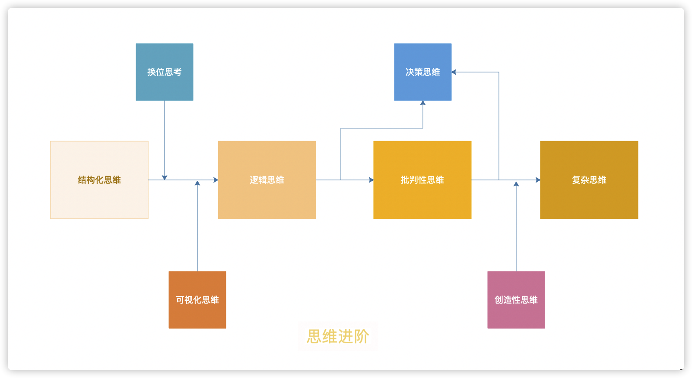
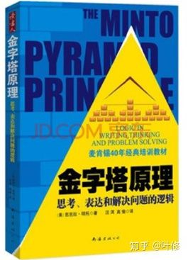
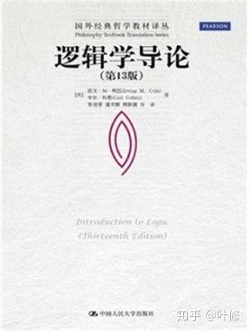
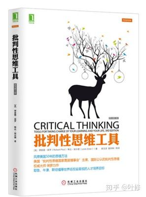
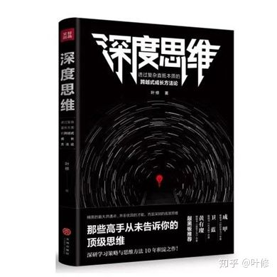
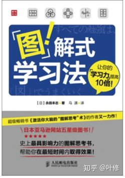
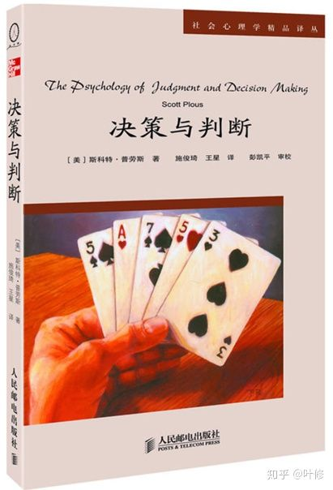
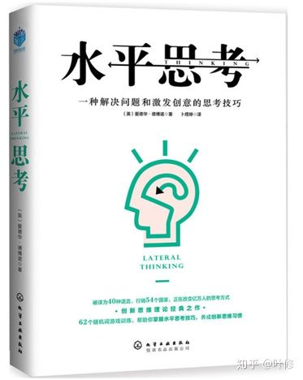

# 思维导图

# 主线
## 结构化思维
### 《金字塔原理》
---
#### 推荐指数：4星
#### 推荐原因：详实，内容非常详细

## 逻辑思维
### 《逻辑学导论》
---
#### 推荐指数：4星
#### 非常简单，纯入门，完全不用担心看不懂。同时也能确实学到东西。案例很多

## 批判性思维
### 《批判性思维工具》
---
#### 推荐指数：5星
#### 经典中的经典，是曾经沧海难为水，除却巫山不是云的最高级别书

## 复杂思维
### 《深度思维》
---
#### 推荐指数：5星
#### 推荐原因：为普通人写的非专业复杂思维的书籍

# 支线
## 可视化思维
### 《图解式学习法》
---
#### 推荐指数：3星
#### 推荐原因：常见的图形思考的画法

## 换位思维（无推荐书籍，建议阅读深度思维）

## 决策思维
### 《决策与判断》
---
#### 推荐指数：5星
#### 推荐原因：非常优秀的一本老书，理论深度很高，学术性强，也没多少数学公式，阅读门槛不高

## 创造性思维
### 《水平思考法》
---
#### 推荐指数：4星
#### 推荐原因：创造性思维领域，德波诺是绝对的大咖

